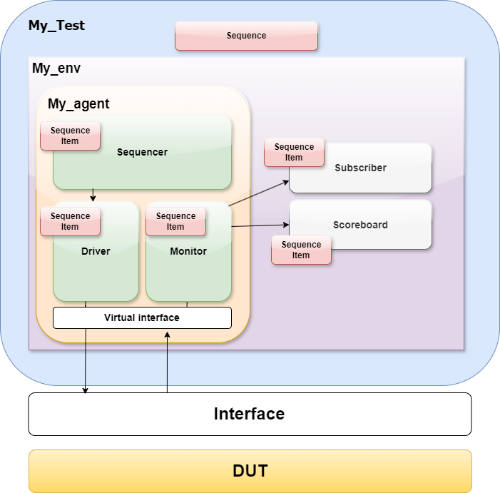
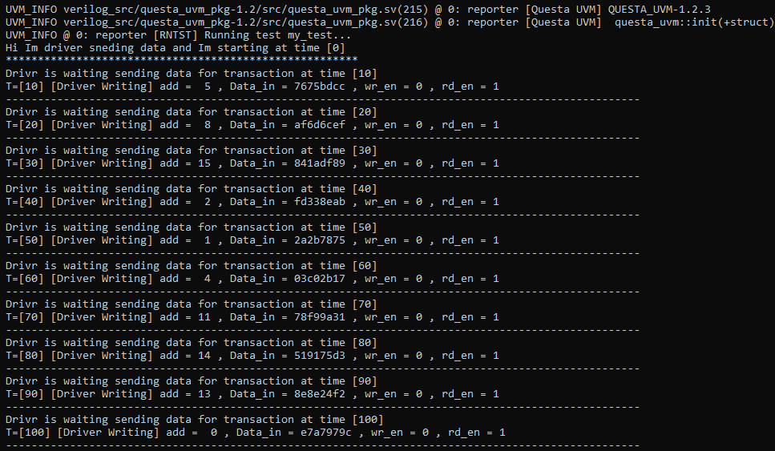
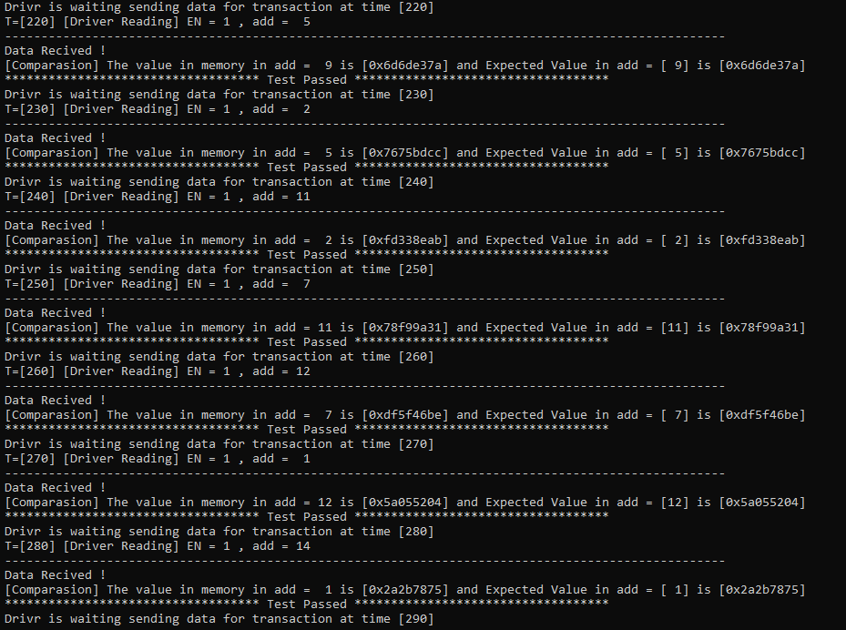

# Full UVM Verification Environment for 16x32 Memory
>This is a UVM-based verification environment to verify the functionality of a 16x32 memory module. This memory module has 16 addressable locations, each with 32-bit wide data. The verification environment will consist of several key components: a testbench >top module, UVM components (agents, sequences, and drivers), and supporting utilities.

🔲 You can see my Repo abou the same Memory module specs and verification Environment without UVM HERE :
>https://github.com/GlassesmanZiad/Full-Verification-Environment-for-16x16-Memory

# 💡 UVM Structure

   

## 📦 Package1 :
It includes various components like sequence items, sequences, drivers, monitors, and scoreboards, all necessary for a functional verification environment.

This package contains the entire UVM testbench setup. The components within it are organized as follows:

- **Sequence Item Class:** Defines a sequence item that encapsulates the data and constraints for the testbench.
- **Writing Sequence Class:** Defines a sequence for writing data.
- **Read Sequence Class:** Defines a sequence for reading data.
- **Sequencer Class:** Manages the sequence of sequence items.
- **Driver Class:** Drives the sequence items into the DUT (Design Under Test) based on the interface.
- **Monitor Class:**  Monitors the DUT's responses and collects data for analysis.
- **ScoreBoard Class:** Compares expected results with actual results and determines the pass/fail status of the test.
- **Agent Class:** Groups together the sequencer, driver, and monitor to form a cohesive verification agent.
- **Env Class:** Defines the test environment by instantiating the agent, scoreboard, and subscriber.
- **Test Class:** Defines the test that sets up the sequences and starts them.

## 📤 Driver Writing:
**✯ First,** The Driver displays a message indicating that the driver is preparing to send data. 

**✯ Then,** Depending on the value of rd_en in seq_item, calls the Disp method to show either "Driver Reading" or "Driver Writing".
>In the Picture Below The driver is writing Data to the dut:

   

## ✅ ScoreBoard and Comparision:
The First stage that we are reading the data which sent when the driver is driving the data to the DUT and store it in internal Register as Refrence.
> The Flow in the ScoreBoard is:
- **Write Operation:** If wr_en is 0, it means the current sequence item is a write operation. The value Data_in is stored in the acc array at index add.
- **Read Operation:** If wr_en is 1, it indicates a read operation. It compares the Data_out from the DUT with the expected value stored in acc at index add.
- **Comparison:** Displays messages indicating whether the comparison passed or failed, based on whether the expected value matches the actual value.
>In the Picture Below The ScoreBoard is Checking the data :

   

#### About The Author

**Author**: *Ziad Ahmed Mamdoh*

**Personal Email**: *ziadahmed1447@gmail.com*

**Education**: *Electronics and communication department.*

**College**: *Faculty of Engineering, Assiut university, Egypt.*

**Brief info.**: *Interested in Digital IC Design and Verification.*

 
